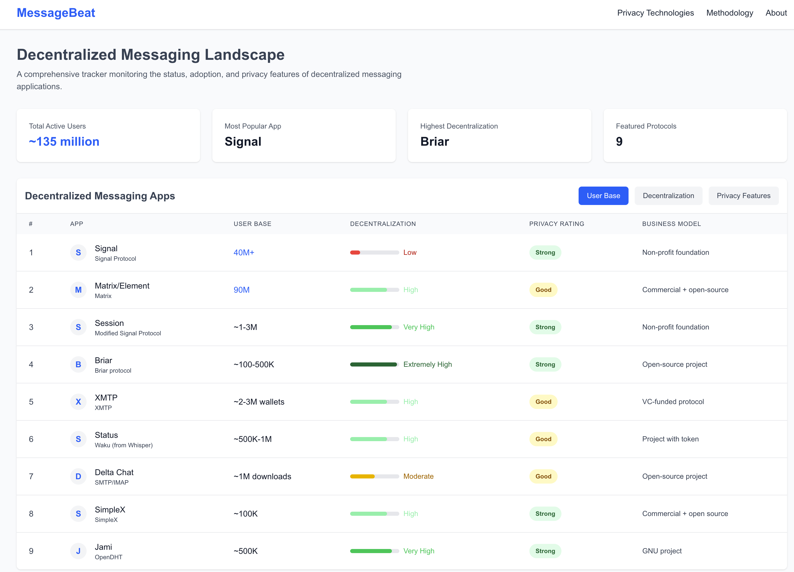

# MessageBeat

A comprehensive dashboard for tracking and comparing decentralized messaging applications, built with Next.js and TypeScript.



## Overview

MessageBeat provides visibility into the decentralized messaging landscape by tracking:

- User adoption metrics
- Decentralization levels
- Privacy features
- Protocol details
- Business models

Similar to how L2Beat tracks Layer 2 solutions for blockchain, MessageBeat helps users understand and compare messaging alternatives beyond centralized services.

## Features

- Interactive sorting and filtering of messaging apps
- Visual indicators for privacy and decentralization levels
- Detailed comparison of critical privacy features
- Responsive design for desktop and mobile
- Type-safe implementation with TypeScript

## Tech Stack

- Next.js 14 with App Router
- TypeScript
- Tailwind CSS
- React Hooks

## Getting Started

### Prerequisites

- Node.js (v18.17 or newer)
- npm or Yarn

### Installation

1. Clone the repository:
```bash
git clone https://github.com/yourusername/decentral-chat-tracker.git
cd decentral-chat-tracker
```

2. Install dependencies:
```bash
npm install
# or
yarn
```

3. Run the development server:
```bash
npm run dev
# or
yarn dev
```

4. Open [http://localhost:3000](http://localhost:3000) in your browser to see the application.

## Project Structure

```
decentral-chat-tracker/
├── src/
│   ├── app/                 # App Router pages
│   ├── components/          # Reusable UI components
│   ├── data/                # Application data
│   └── types/               # TypeScript interfaces
├── public/                  # Static assets
└── ...config files
```

## Deployment

Build the application for production:

```bash
npm run build
# or
yarn build
```

Then start the production server:

```bash
npm start
# or
yarn start
```

Or deploy to platforms like Vercel, Netlify, or any other hosting service that supports Next.js.

## Contributing

Contributions are welcome! Here's how you can contribute:

1. **Fork the repository**
   - Create a personal copy of the project on your GitHub account

2. **Set up your environment**
   - Follow the installation steps above
   - Make sure everything builds correctly

3. **Create a feature branch**
   ```bash
   git checkout -b feature/your-feature-name
   ```

4. **Make your changes**
   - Add or update features
   - Update documentation if needed
   - Add new messaging apps or update existing data

5. **Follow coding standards**
   - Use TypeScript for type safety
   - Format your code with Prettier
   - Ensure your code passes ESLint checks

6. **Test your changes**
   - Make sure the application works as expected
   - Test on different screen sizes for responsiveness

7. **Submit a pull request**
   - Push your changes to your fork
   - Create a pull request to the main repository
   - Describe your changes in detail
   - Link any related issues

### Updating App Data

To add a new messaging app or update existing data:

1. Edit the `src/data/apps.ts` file
2. Follow the `App` interface structure in `src/types/index.ts`
3. Make sure to include all required properties
4. Update `src/data/stats.ts` if total numbers have changed

## License

This project is licensed under the MIT License - see the [LICENSE](LICENSE) file for details.